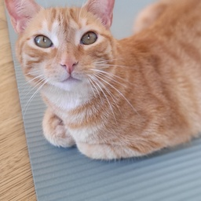
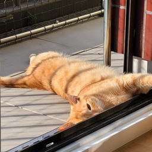
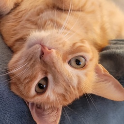

# Cat (Piri-Piri) Detection

## 1. Project Description

### Goal
Meet Piri-Piri, a Portuguese cat currently living in Zurich, Switzerland! The goal of this project is to accurately distinguish Piri-Piri from other cats using Convolutional Neural Networks (CNNs). While this project has no immediate practical value, I might build a cat door at some point that only opens for him ;).

### Data
- 165 resized pictures of Piri-Piri that I took with my smartphone (**positive class**)
- 12'501 pictures of other cats (**negative class**) from this source: Cukierski, W. (2013). *Dogs vs. Cats*. Kaggle. [https://kaggle.com/competitions/dogs-vs-cats](https://kaggle.com/competitions/dogs-vs-cats)

For the negative class, a sample of 200 pictures from the above-mentioned source will be used.

### Method

#### Quick Intro to CNNs

A convolutional neural network (CNN) is a type of feed-forward neural network designed to automatically learn features through filter optimization. CNNs are widely used in deep learning tasks, particularly in computer vision, image processing, and more recently, in areas like text and audio processing. CNNs help address issues like vanishing and exploding gradients during backpropagation by using regularized weights and fewer connections. Higher layers extract features from broader contexts compared to lower layers.

#### Small Custom CNN

At this stage of the project, the goal is to keep it simple. Therefore, a small custom CNN is trained in this project using Keras and TensorFlow.

#### Transfer Learning Using EfficientNetB0 (for comparison)

Transfer learning using EfficientNetB0 is used for comparison and experimentation purposes.
